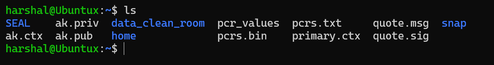
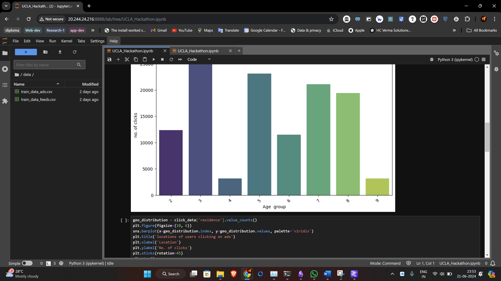

# UCLA-Hackathon

#### Overview 

Highlighting the main theme of this event  of utilizing Generative AI to empower “Data Collaboration Intelligence”. We developed a data sharing platform that allows private data sharing, predictive analytics and model building among different data parties, in essence, the “Data Clean Room” to enhance Click-through Rate (CTR) predictions using privacy-preserving synthetic data.

In both of the Parts, i.e., Implementation and Evaluation, we used various technologies including Azure Confidential Cloud VM, imbibing TDVM was well as TEE (Trusted Execution Environments),specifically Intel® TDX and SGX, GAN neural network, Gen AI, and Machine Learning Models. Similarly, several concepts like Hashing, Trusted Computing, Synthetic Data Fidelity and Synthetic Data Utility, Verification of Quote and Return Key.

---

## Data Clean Room Overview

\
 

---