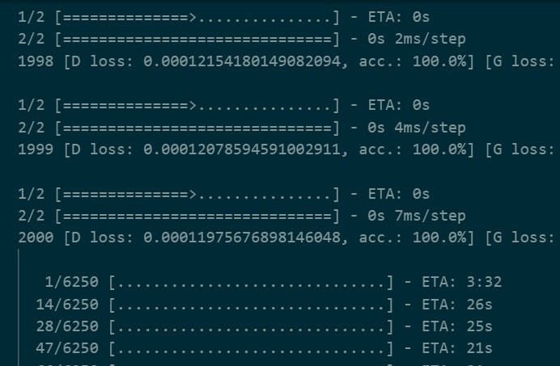

# Deep GAN: Generating Synthetic Data from Dataset

## Description

This project implements a Deep Convolutional Generative Adversarial Network (DCGAN) to generate synthetic data that resembles real-world script data from the provided `merged_train_data.csv` file. The model captures the underlying statistical distribution of the dataset, producing realistic, high-quality samples.

### Key Features

- **Efficient Preprocessing**: Handles missing values, converts data to appropriate numerical types, and performs label encoding and standardization for both categorical and numerical features.
- **DCGAN Architecture**: Utilizes a well-established DCGAN architecture with LeakyReLU activation, BatchNormalization, and dense layers to learn complex data representations.
- **Gradient Clipping**: Mitigates gradient explosion issues during training by clipping gradients with a specified threshold.
- **Noise Injection**: Enhances model robustness by introducing noise to labels during discriminator training.
- **Regularization**: Enforces weight decay to prevent overfitting and improve model generalization.
- **Sample Generation with Control**: Allows generation of a desired number of synthetic data points at specified intervals during training.
- **Invertibility**: Ensures the generated data is interpretable by transforming it back to the original scale and category labels using the fitted scaler and label encoders.
- **Reproducibility**: Maintains consistency in training results by setting a random seed for both NumPy and TensorFlow.

## Instructions

### Prerequisites

- Python 3.x
- Necessary libraries: Install using `pip install pandas numpy tensorflow keras sklearn`

### Data Preparation

1. Place the `merged_train_data.csv` file in the project directory.

### Execution

1. Run the Python script (e.g., `main.py`) to initiate training. The script will:
    - Load and preprocess the script data.
    - Build and compile the DCGAN model.
    - Train the GAN for a specified number of epochs.
    - Generate and save synthetic data samples at regular intervals.

### Output

- The script will create CSV files named `synthetic_data_epoch_{epoch}.csv`, containing the generated synthetic data at specified epochs.
    Epoch interval= 2000
    

## Customization

- Modify the `latent_dim` and `output_dim` variables in the script to control the dimensionality of the latent space and generated data, respectively.
- Adjust the `epochs` and `batch_size` hyperparameters to fine-tune the training process.
- Experiment with different network architectures (e.g., deeper layers, different activation functions) to potentially improve model performance.

## Further Development

- Explore alternative GAN architectures (e.g., Wasserstein GAN, CycleGAN) to potentially achieve better generation quality or address specific data characteristics.
- Implement techniques like spectral normalization or weight initialization to further stabilize the training process.
- Integrate visualization tools (e.g., TensorBoard) for detailed monitoring of training progress and generated samples.
- Consider applying the generated synthetic data to downstream tasks, such as anomaly detection or data augmentation.

